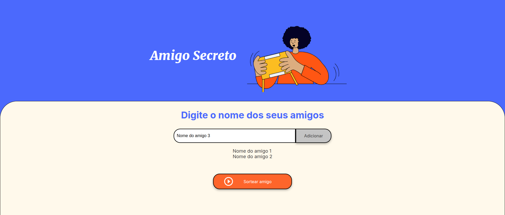
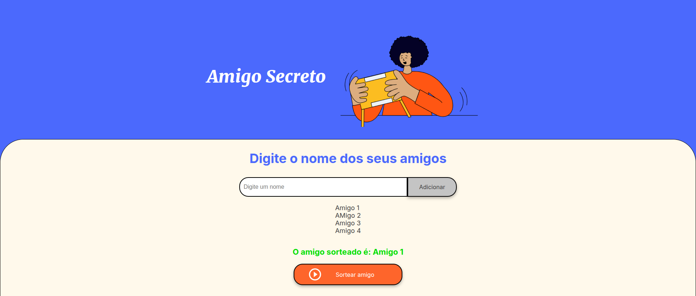

<h1 align="center">
    
</h1>

# Descrição do Projeto

Challenge do amigo secreto, uma aplicação am javascript que faz o sorteio de uma lista de nomes dos amigos envolvidos.

# Funcionalidades do projeto

- `Adicionar nome a lista de amigos`: adicione quantos amigos quiser

- `Sorteio de amigo secreto`: a aplicação realiza o sorteio de um amigo secreto para você

# Autores

[ Eduardo Damasceno](https://github.com/edu-damasceno)

# License

O Challente do Amigo Secreto é licensidado pelo MIT.